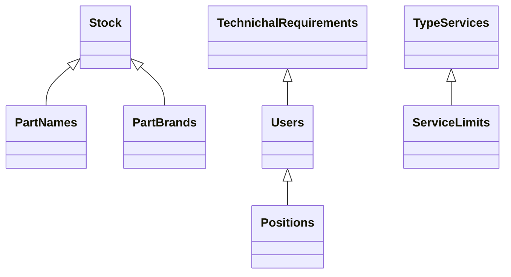
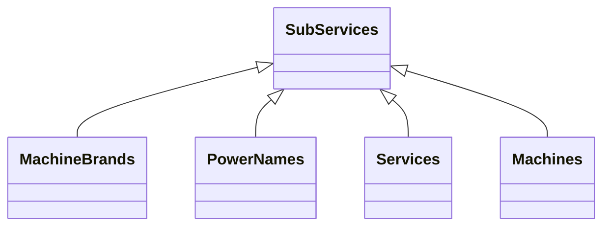
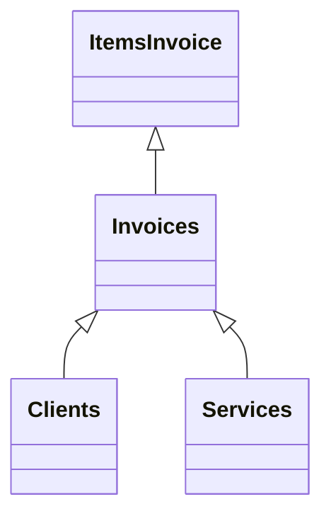
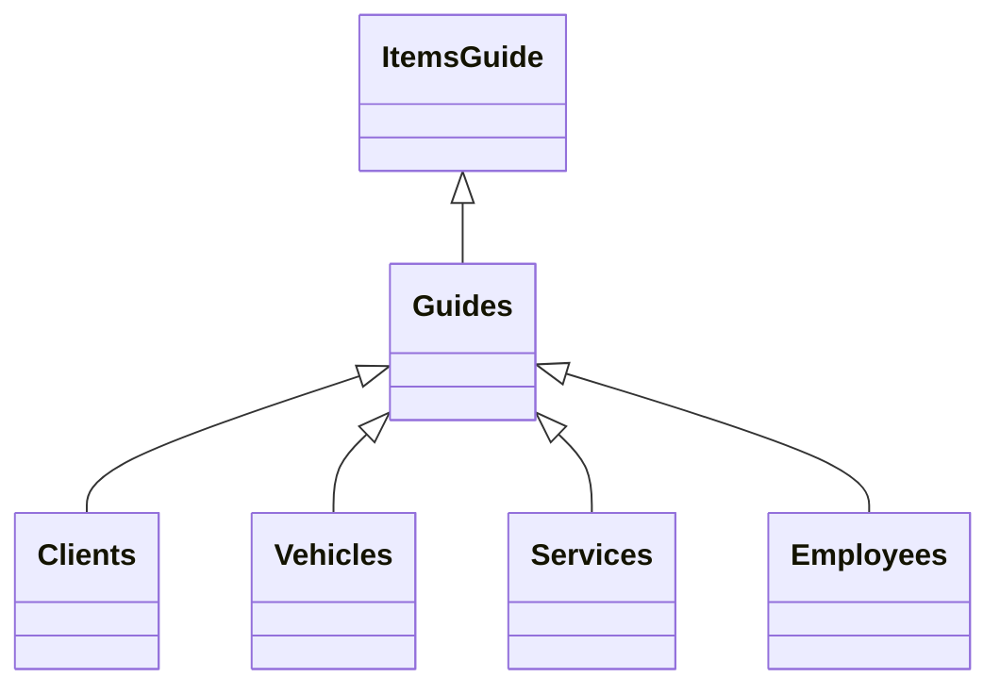
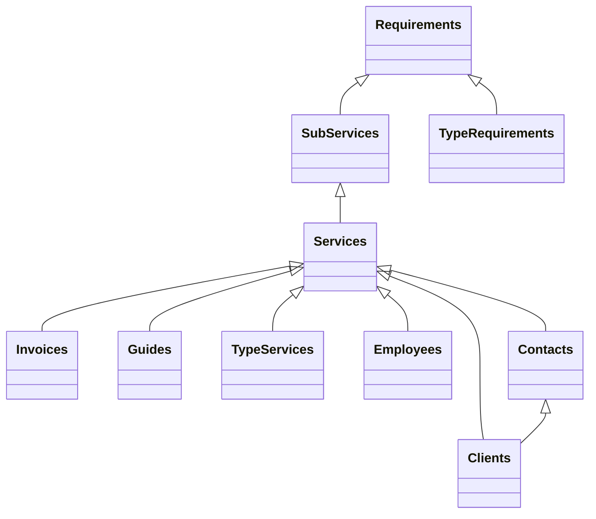
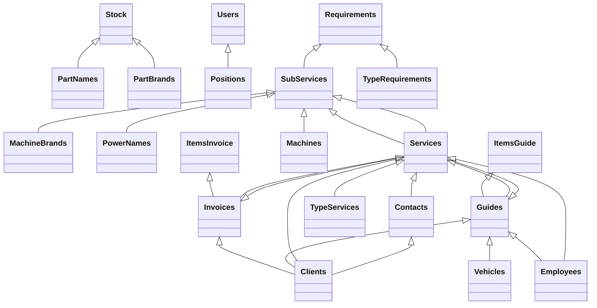

# BASE DE DATOS

## TABLAS INDEPENDIENTES

  ### Clients | Clientes 
  - name ***string*** : Razon social del cliente
  - RUC ***number*** : RUC del cliente
  - address ***string*** : Direccion del cliente (facturacion)
  - isAbm ***boolean*** : Cliente habilitado de ABM
  - isMega ***boolean*** : Cliente habilitado de Megaman

  ### TypeServices | Tipos de servicio
  - name ***string*** : Rebobinado, Mantenimiento, Fabricacion, Balanceo, Venta, Alineamiento, Reclado, Parada, Otros

  ### PowerNames | Tipos de potencia
  - name ***string*** : HP, kW, CV, KVA

  ### PartNames | Nombres de partes
  - name ***string*** : Rodamiento, Reten, Ventilador, Funda, Bornera, ...

  ### PartBrands | Nombre de marcas de repuestos
  - name ***string*** : SKF, KOYO, FAG, NTN, ....

  ### Machines | Nombres de Maquinas
  - name ***string*** : Motor, Transformador, Motor universal, Motor DC, Freno, Generador, Motoreductor, ....

  ### Positions | Puestos en el organigrama
  - name ***string*** : Tecnico, contador, oficina, .....

  ### MachineBrands | Nombres de marcas de maquinas
  - name ***string*** : Siemens, Delcrosa, WEG, AEG, CAT

  ### TypeRequirements | tipos de requerimientos
  - name ***string*** : Servicio, repuesto, insumo, otros

  ### Vehicles | Vehiculos de la empresa
  - name ***string*** : Nombre dado al vehiculo
  - plate ***string*** : Placa al vehiculo
  - soat ***bigInt*** : Fecha vencimiento soat
  - revTech ***bigInt*** : fecha vencimiento revision tecnica

---
## TABLAS DEPENDIENTES SIMPLES

  #### Contacts | Persona de contacto del cliente
  - name ***string*** : Nombre y apellido del encargado del cliente
  - email ***string*** : correo de contacto
  - phone ***number*** : Numero de telefono de contacto
  - clientID *relation* : Relacion uno a muchos (a que cliente pertenece el contacto)

    ----
    PENDIENTE sistema login
    ----
  ### Users | Usuarios de la aplicacion - (trabajadores de la empresa)
  - name ***string*** : Nombre y apellido del trabajador
  - userName ***string*** : usuario del trabajador
  - password ***hash*** : contraseña del trabajador
  - phone ***number*** : Telefono de contacto
  - driverLic ***string*** : Licencia del trabajador
  - dni ***number*** : DNI del trabajador
  - positionID *relation* : uno a muchos (que puesto ocupa el trabajador)

  ### Stock | Inventario de repuestos
  - name ***string*** : Descripcion del repuesto (6204, 25-30-6, ...)
  - quantity ***number*** : Cantidad en stock
  - buyPrice ***number*** : PRecio de compra en soles
  - salePrice ***number*** : Precio de venta en soles
  - partNameID *relation* : Relacion uno a muchos (que tipo de repuesto es)
  - partBrandID *relation* : Relacion uno a muchos (que marca de repuesto es)

  ### ServiceLimits | Alcance de tipos de servicios
  - name ***string*** : Descripcion del procedimiento
  - order ***number*** : Orden del procedimiento
  - typeServiceID ***relation*** : Uno a muchos (Tipo de servicio)

  ### TechnicalRequirements | Peticiones de compra de técnicos
  - name ***string*** : Descripcion de lo solicitado
  - quantity ***number*** : Cantidad de lo solicitado
  - done ***bool*** : Compra efectuada
  - userID ***relation*** :Uno a muchos - Solicitante

## TABLAS DEPENDIENTES COMPLEJAS
  ### Invoices | Facturas de venta (verificar con la documentacion de sunat.api)
  - serial ***string*** : Serie de la factura (F001)
  - number ***number*** : Numero de la factura 
  - company ***boolean*** : *True* para ABM y *false* para Megaman
  - total ***number*** : Monto total de la factura (sin igv)
  - detraction ***number*** : Porcentaje de la detraccion
  - credit ***number*** : Dias de credito
  - aditional ***string*** : Observaciones en la factura
  - pdfDrive ***string*** : id de el archivo en google drive
  - xmlDrive ***string*** : id de el archivo en google drive
  - cdrDrive ***string*** : id de el archivo en google drive
  - paid ***boolean*** : Si esta pagado o no
  - payDate ***bigInt*** : Fecha en milisegundos de ejecucion de pago
  - operation ***number*** : Numero de operacion del pago
  - clientID *relation* : Relacion uno a muchos (a que cliente se facturo)
  - serviceID *relation* : Relacion uno a muchos (a que OT pertenece)
  

  ### ItemsInvoice | Elementos de facturas
  - quantity ***number*** : Cantidad
  - description ***string*** : Descripcion
  - order ***number*** : Orden de impresion
  - unitPrice ***number*** : Valor Unitario
  - invoiceID *relation* : Uno a muchos (a que factura pertenece)

  ### Guides | Guias de remision
  - company ***boolean*** : *True* para ABM y *false* para Megaman
  - serial ***string*** : Serie de la guia (T001)
  - number ***string*** : Numero de la guia
  - date ***bigInt*** : Fecha de traslado/emision 
  - kg ***number*** : Peso total del cargamento
  - reason ***string*** : Motivo de traslado
  - aditional ***string*** : Observaciones
  - ourCharge ***bool*** : True si lo lleva alguien de la empresa o false si lo lleva el cliente
  - clientID *relation* : Relacion uno a muchos (a que cliente se le envia)
  - vehicleID *relation* : Relacion uno a muchos (en que vehiculo se envia)
  - serviceID *relation* : Relacion uno a muchos (a que servicios pertenece)
  - userID *relation* :  Relacion uno a muchos (que trabajador lo despacha)

  ### ItemsGuide | Elementos de Guia
  - quantity ***number*** : Cantidad
  - description ***string*** : Descripcion
  - order ***number*** : Orden de impresion
  - guideID *relation* : Uno a muchos (a que guia pertenece)

  ### Services | Servicios realizados
  - OT ***number*** : Numero de OT
  - company ***boolean*** : *True* para ABM y *false* para Megaman
  - dateArribal ***bigInt*** : Fecha de recepcion de servicio (si esta vacio, es solo presupuesto)
  - dateDispatch ***bigInt*** : Fecha de despacho de servicio
  - guideArribal ***string*** : Guia de recepcion
  - description ***string*** : Descripcion general del servicio
  - price ***number*** : Costo total del servicio sin IGV
  - purchaseOrder ***string*** : Orden de servicio
  - purchaseConfo ***string*** : Conformidad de servicio (para los que la aplican)
  - imagesFolder ***string*** : ID de la carpeta de google drive para guardar las imagenes
  - presDate ***bigInt*** : Fecha de emision del presupuesto
  - presClientInformation ***string*** : Descripcion-informacion de la guia de remision del cliente
  - presPaymentMethod ***string*** : Metodo de pago del presupuesto
  - presDispatchTime ***string*** : Tiempo de entrega del servicio
  - presDispatchPlace ***string*** : Lugar de entrega del servicio
  - presWarranty ***string*** : Tiempo de garantia del servicio
  - presValidity ***string*** : Tiempo de validez del presupuesto
  - presVersion ***number*** : Version del presupuesto
  - invoiceID *relation* : muchos a muchos (factura del servicio)
  - guideID *relation* : uno a muchos (guia de despacho del servicio)
  - typeServiceID *relation* : uno a muchos (tipo de servicio)
  - employeeID *relation* : uno a muchos (trabajador encargado del servicio)
  - clientID *relation* : uno a muchos (cliente del servicio)
  - contactID *relation* : uno a muchos (personal del cliente encargado del servicio)

  ### SubServices | Datos de placa de equipos
  - subOT ***number*** : Numero de sub OT
  - power ***number*** : Potencia del equipo
  - rpm ***string*** : RPM del equipo
  - hz ***String*** : Frecuencias de funcionamiento del equipo
  - voltage ***string*** : Voltajes de trabajo del equipo
  - current ***string*** : Corrientes de trabajo del equipo
  - price *** string*** : Precio del servicio
  - machineBrandID *relation* : uno a muchos (marca del equipo)
  - powerNameID *relation* : uno a muchos (unidad de medida de potencia)
  - serviceID *relation* : uno a muchos (OT del servicio)
  - machineID *relation* : uno a muchos (tipo de maquina)

  ### Requirements | Requerimientos de sub ots
  - quantity ***number*** : Cantidad de requerimientos
  - description ***string*** : Descripcion de requerimientos
  - price ***string*** : Precio del requerimiento
  - typeRequirementID *relation* : uno a muchos (tipo de requerimiento)
  - subServiceID *relation* : uno a muchos (Sub OT del requerimiento)

## RELACIONES

---

